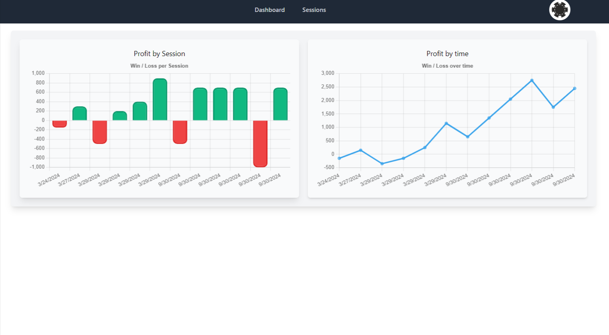
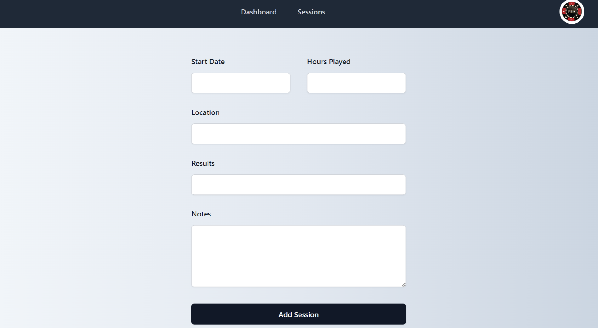
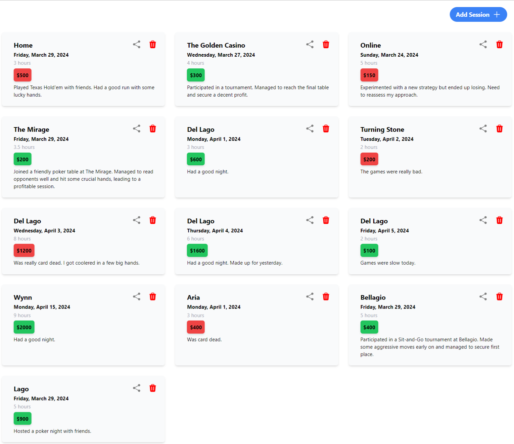

# poker-buddy

## Description

This is a simple yet efficient poker session tracking application designed to help players keep detailed records of their poker sessions. Whether you're a casual player or a seasoned pro, this app will assist you in monitoring your progress, analyzing your performance, and ultimately improving your game.

## Screen Shots

## Languages and Technologies Used

Mongoose, GraphQL, React, Tailwind CSS, Node, Express, Javascript, HTML, MongoDB

## Live Link

https://poker-buddy-1.onrender.com/

